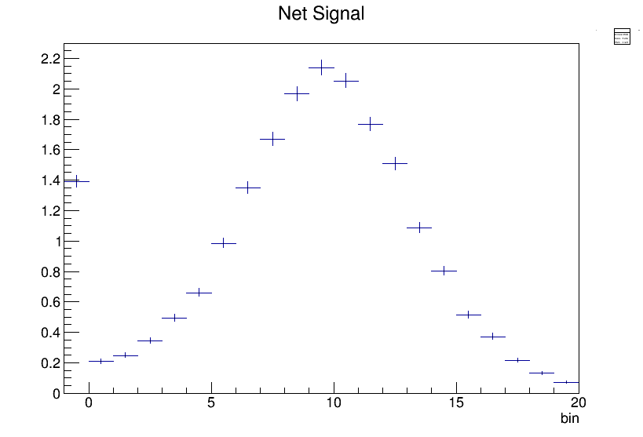
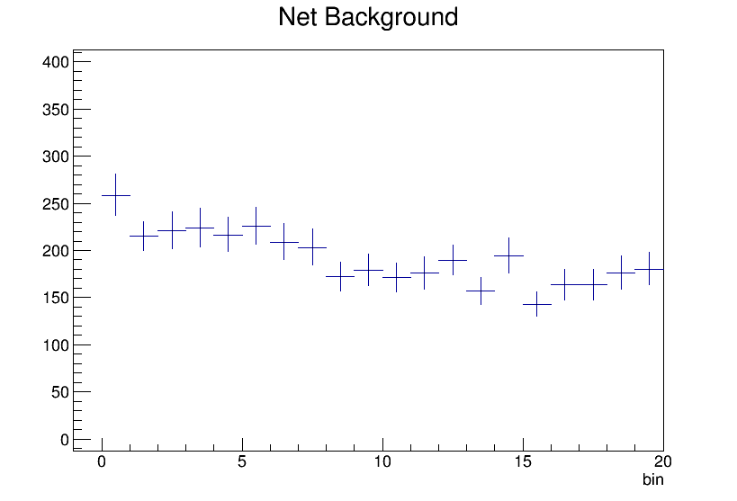
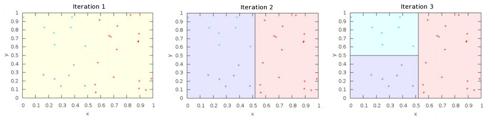

# Autocategorizer
https://github.com/acarnes/autocategorizer/

See https://github.com/acarnes/autocategorizer/blob/master/autocategorizer.pdf for a thorough description of the algorithm. A brief mathless summary is below.

The autocategorizer will maximize the expected statistical significance for an expected hypothesis compared to the null. The null hypothesis might be that no Higgs boson exists, while the expected hypothesis might be the Standard Model predictions for the Higgs boson. Physicists have a lot of faith in the Standard Model, so that's a reasonable hypothesis to expect. 

The algorithm compares the histograms for the null and the expected hypothesis along a specific variable and finds regions of feature space that maximize the global difference between the hypotheses. As is common in particle physics, we call the expected hypothesis signal plus background (S+B), and we call the null the background (B). The algorithm requires S and B binned along some PDF variable. The rest of the discriminating variables are used as the features. 




The signal quantifies the discrepancy between the null hypothesis and the expected hypothesis. When the signal is large compared to an expected fluctuation from the null, the expected hypothesis and the null are significantly different. The algorithm uses a decision tree to separate feature space into discrete regions that in combination maximize a global significance metric. The discrete regions of feature space are called categories. 



Maximizing the metric should minimize the expected p-value given the expected hypothesis. The metric should account for the combined likelihood over all categories. One metric in the package is the Poisson Significance, which is described in the pdf linked above. The Poisson Significance is derived from the combined log-likelihood by approximating each Poissonian contribution as a Gaussian. Another metric available in the autocategorizer package is based on the Asimov Significance, which does not make a Gaussian approximation. The decision tree chooses regions of feature space such that the difference between S+B and B is maximally different according to the chosen metric of global statistical difference.   

## The Autocategorizer In Practice

 The algorithm needs to know the class (signal/bkg/data), the weight (in particle physics this would include the xsec, lumi, scale_factors, mc_weight/sum_weights), the bin each data point belongs to in the histogram of the PDF variable, and the features. It takes in the csv files or flat ntuples with the sig/bkg, weight, bin, and feature info. It outputs an xml file of the categories with the cuts for each variable in the form of a decision tree. It will also output the category definitions as strings. The autocategorizer uses the convention signal=1, bkg=0, data=-1. Signal and background come from simulation of the null and expected hypotheses, and the data is real data. The package was created for high energy physics analyses so it uses ROOT. This is an unfortunate dependency for people outside the field, so I'll try to remove this dependency in the future.  

A simple example is provided by example/train.cxx. Use the makefile to compile the executable. Then run it. The example generates some data and runs to autocategorizer to make categories that maximize the significance. Examples using the full machinery, which read in particle physics simulation/data from csv or ROOT ntuples are given by studies/h2mu and studies/vhbb. This data/simulation belongs to CMS, so I can't put it into the github repo. But you can check it out if you are a member of the CMS experiment with access to lxplus. 

Including real data is optional. Only the simulated S and B events are needed. Real data is only used to correct the simulated background predictions if the real data shows that the total amount of predicted background is off. The appropriate way to use data with this library is to include some data and some background mc in a control region -- some area of feature space where the background and the data should match and set bin=-1 for these events. Then you can turn on the scale-data flag, and the bkg simulation and data in this -1 bin will be used to determine the data/bkg ratio, and this ratio will be used to scale the amount of bkg predicted by simulation in the bins of the histogram (0 to nbins-1).  

You can see how the full machinery runs in studies/h2mumu/BasicTrainAndTest.cxx. There is a makefile to compile the executable. Just run `make` then run with `./BasicTrainAndTest opt1 opt2 ... opt8`. Here are all of the options.
```
        if(i==1) varset = ss.str().c_str(); // string telling which variables to use for categorization
        if(i==2) ss >> nodes;               // the number of categories 
        if(i==3) ss >> nbkgmin;             // the smallest amount of background allowed in a bin (prevent overtraining)
        if(i==4) ss >> unctype;             // the uncertainty type to use, 0 means no extra uncertainty

        if(i==5) ss >> scale_fluctuations;  // scale bkg in a bin if it is too low (false low bkg makes the significance too high)
                                            // uses an adhoc estimate based upon the bkg out of the window
                                            // this was specific to h2mumu 2016 data, I wouldn't use this

        if(i==6) ss >> scale_data;          // scale the bkg in the window based upon data/bkg outside the window

        if(i==7) ss >> smooth;              // smooth the estimate of the bkg in a bin by averaging it with its neighboring bins
                                            // this helps get rid of downward fluctuations in the bkg from low stats

        if(i==8) ss >> nparams;             // this is only important for a certain uncertainty type, you shouldn't need this
```
If you run the code without any options (./BasicTrainAndTest) it will use the default values for nodes, nbkgmin, unctype, scale_fluctuations, scale_data, smooth, and nparams defined at the top of the .cxx file. 

LoadEvents.hxx has code to load the events from the csv/ntuples. I was running BasicTrainAndTest.cxx on the ntuples at the ufhpc (University of Florida High Perfomance Computing servers) at /home/puno/h2mumu/UFDimuAnalysis_v2/bin/rootfiles/bdt. To get the code running you can copy those over to wherever you are working or set up your code on the uf hpc and run on them directly. I also copied the ntuples needed for h2mumu/BasicTrainAndTest.cxx over to lxplus at /afs/cern.ch/work/a/acarnes/public/autocat/bdt/studies/h2mumu/infiles. Once you have the code running with those files you can move ahead and work with your own.  

When you run the code you will see some output like this
```
  1 Nodes : 0.844168
        +root: 0.844168, 1873402, 267789, 272802, 227.964, 113487, 391514, 371845
  2 Nodes : 1.02409
        +root left: 0.632931, 1482039, 158306, 218095, 163.323, 103209, 354985, 337907
        +root right: 0.805078, 391363, 109483, 54707, 64.641, 10278.2, 36529, 33937.6
  ...
```
which translates to
```
# Nodes: netSignificanceScore
  category A: significanceScore, numEvents, numSignal, numBKG, sumSigWeighted, sumBKGWeighted, dataOutsideWindow, BKGOutsideWindow
  category B: significanceScore, numEvents, numSignal, numBKG, sumSigWeighted, sumBKGWeighted, dataOutsideWindow, BKGOutsideWindow
```
This info can be useful to debug the program. numX refers to the number of events used. Each event may have a weight. sumXWeighted refers to the expected amount of signal or bkg calculated by summing the weights. When weight=1 for all X type events this will match numX. 
Then at the end of the output, you will see the feature importance and the cut strings defining the categories. The feature importance is calculated by summing the improvement to the significance metric due to each feature during training.
```
Ranking Variables by Net Error Reduction... 
x2, x2: 100
x1, x1: 19.9315
x0, target: 0

Done.

    (c0) (0.0028) x2 <   0.009 && x1 <  -0.644
    (c1) (0.0160) x2 >   0.009 && x1 <  -1.930
    (c2) (0.3217) x2 <   0.009 && x1 >  -0.644
    (c3) (1.9104) x2 >   0.009 && x1 >  -1.930
    root
```
When you run on your own ntuples or csv files make sure you specify the number of bins used for your pdf variable via `nbins = your_#_of_bins` in BasicTrainAndTest.cxx. Every event must have a bin value, and a valid bin value is 0 <= bin <= nbins-1. This bin is the bin the event belongs to in the S or B histogram along the pdf variable. The code is pretty well commented so check it out. 

Here's some info for particle physics people at CMS. The probability density function we put into higgs combine for H->mumu is along the dimuon mass spectrum. So the bin values used in the autocategorizer were along the dimuon mass. I had twenty bins (if I remember right) representing which 0.5 GeV mass bin in the 120-130 GeV signal region the event fell into. This would corresond to nbins=20 and a valid bin would have a value in the range 0 <= bin <= 19. bin 0 would correspond to a dimuon mass in 120 to 120.5 GeV, bin 1 to a mass in 120.5 to 121 GeV, etc. You can see an example of these histograms in the Net Signal and Net Background histograms earlier in the README. 

A bin value of -1 means an event fell in a control region outside the signal window. These bin=-1 events can optionally be used used to scale the mc in the signal window based upon the data/mc ratio in the control region outside the window and for some other optional corrections. If you are using some machine learning algorithm score as the pdf for higgs combine then you would bin the signal/bkg along that variable.

For people at UF, the bin/outputToDataframe.cxx script in the UFDimuAnalysis repo creates the needed csv/ntuples. The output xml file can be automatically used by UFDimuAnalysis/bin/categorize.cxx through the XMLCategorizer class. You just need to set the appropriate option like ./categorize --categories=output_xml_file.xml. Because of string->function map in VarSet.h/.cxx, our library can automatically calculate the value of a feature based upon the name of the feature. The xml file has the cuts based upon the feature names, which along with our varset map allows us to automate the autocategorizer->plotting process.
